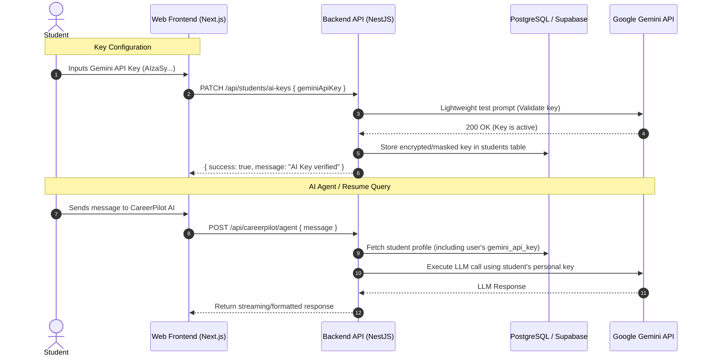

# Bring Your Own Key (BYOK) Architecture & Implementation Guide

## 1. Executive Summary & Rationale

### Why BYOK?
On free-tier AI providers (Google AI Studio / Gemini, Groq Cloud):
- **Single Server Key Limit**: Free accounts have a strict quota (e.g., **15 Requests Per Minute / 1,500 Requests Per Day**). When 10–20 students use the platform simultaneously, a shared server key hits **HTTP 429 (Too Many Requests)** errors.
- **BYOK Scalability**: When each student provides their own free personal API key, every student gets their own private 15 RPM / 1,500 RPD quota. The platform scales infinitely at **$0.00 backend cost**.

---

## 2. Student Experience (30-Second Setup)

Google AI Studio provides free Gemini API keys without requiring a credit card or billing setup.

### Student Guide Flow:
1. **Sign Up / Log In**: Student logs in via Google OAuth or Email.
2. **Setup Prompt**: When opening the **CareerPilot AI Chat** or visiting **Profile / Settings**, a card prompts:
   > *"Connect your free Gemini API key to unlock unlimited AI resume parsing and career coaching."*
3. **1-Click Generation**:
   - Student clicks `[Get Free Google Gemini Key]`.
   - Opens `https://aistudio.google.com/app/apikey`.
   - Student clicks **"Create API Key"** and copies the string (`AIzaSy...`).
4. **Paste & Verify**:
   - Student pastes the key into CareerPilot.
   - CareerPilot makes a lightweight test call (`gemini-1.5-flash`) to verify validity.
   - Saves successfully and unlocks all AI features.

---

## 3. System Architecture & Data Flow



---

## 4. Technical Implementation Plan

### Step 1: Database Migration
Add columns to `students` to store user-provided AI keys:

```sql
-- Add user AI key columns
ALTER TABLE students 
ADD COLUMN IF NOT EXISTS gemini_api_key TEXT,
ADD COLUMN IF NOT EXISTS groq_api_key TEXT,
ADD COLUMN IF NOT EXISTS ai_provider VARCHAR(32) DEFAULT 'gemini';
```

---

### Step 2: Backend Dynamic Key Resolution (NestJS)

Update `AgentService` and `ResumeService` to dynamically resolve keys with a fallback:

```typescript
// Example: Dynamic key resolver in NestJS
export class AgentService {
  private getClient(userApiKey?: string) {
    const apiKey = userApiKey?.trim() || process.env.GEMINI_API_KEY;
    if (!apiKey) {
      throw new BadRequestException(
        "No Gemini API key found. Please add your free key in Settings to use CareerPilot AI."
      );
    }
    return new GoogleGenAI({ apiKey });
  }

  async handleChatMessage(userId: string, message: string) {
    const student = await this.getStudent(userId);
    const aiClient = this.getClient(student?.gemini_api_key);
    // Proceed with LLM execution using user's dedicated quota
  }
}
```

---

### Step 3: Frontend UI Components

#### A. Settings / Profile "AI Provider" Card
- Input field with password masking (`••••••••••••••••••••`).
- **"Test & Save Key"** button with immediate feedback.
- Direct link: `https://aistudio.google.com/app/apikey` with badge `100% Free - No Credit Card`.

#### B. First-Use Modal for CareerPilot Agent
- If `student.gemini_api_key` is null when clicking "Ask CareerPilot", open an interactive modal explaining how to paste their free key.

---

## 5. Security & Privacy Best Practices

1. **Transport Security**: All API keys are transmitted exclusively over encrypted HTTPS connections.
2. **Access Control**: Users can only read/write their own key via authenticated Supabase RLS and session tokens.
3. **No Hard Logging**: Never log raw API keys to server logs or monitoring systems.
4. **Key Verification**: Always run a zero-token validation ping before saving so students know immediately if their key is valid.

---

## 6. Summary Comparison

| Aspect | Shared Server Key | Bring Your Own Key (BYOK) |
| :--- | :--- | :--- |
| **Server Cost** | High / Risk of paid tier bills | **$0.00 Forever** |
| **Rate Limit Risk** | High (1 shared key gets 429 errors) | **Zero (Each student has private 15 RPM)** |
| **User Independence** | One student's abuse affects everyone | **Completely isolated quotas** |
| **Setup Time** | 0 seconds | **~30 seconds (1-time setup)** |
